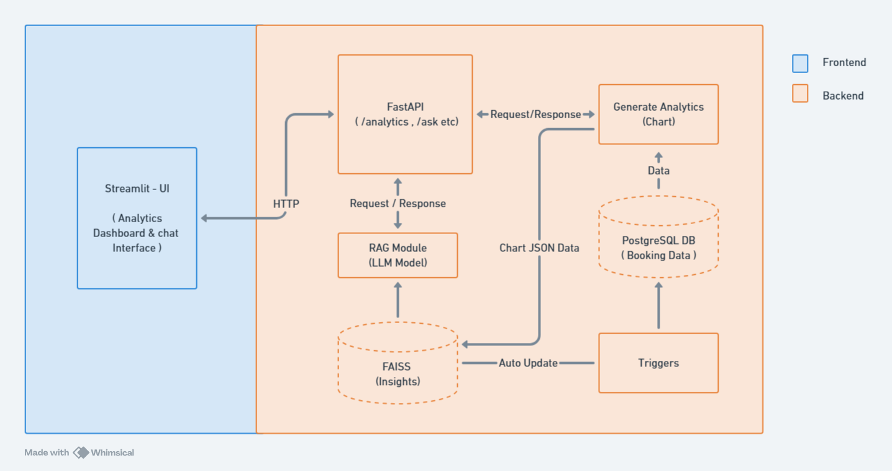

# Hotel Booking Analytics & RAG System

## Overview

This project is an interactive system that processes hotel booking data, generates dynamic analytics, and supports retrieval-augmented question answering (RAG). The system uses a REST API built with FastAPI, a PostgreSQL database for data storage, and a Streamlit-based frontend for interactive visualization and user interaction.

## Features

- **Analytics:** Generate interactive charts for revenue trends, cancellation rates, geographical distribution, booking lead time, ADR distribution, stay duration, and monthly trends.
- **Question Answering:** Utilize a RAG pipeline combining FAISS, LangChain, and the Ollama model to answer natural language questions about hotel bookings.
- **Dynamic Data Updates:** Insert new booking records and automatically update insights using PostgreSQL triggers and notifications.
- **Health Check:** Monitor the health status of core components including the database, vector store, and QA chain.

## Tech Stack

- **FastAPI & Uvicorn:** Fast, asynchronous REST API development.
- **PostgreSQL:** Reliable, scalable relational database with real-time notifications.
- **Pandas, Matplotlib, Seaborn, Plotly:** Data manipulation and interactive visualization.
- **Streamlit:** User-friendly frontend for real-time dashboard display.
- **LangChain with Ollama (phi4:latest):** RAG pipeline for high-quality context-aware question answering.
- **Ollama Embedding Model (nomic-embed-text):** Advanced text encoder for accurate embeddings.
- **FAISS:** Efficient vector search and storage for retrieving insights.

## Architecture Design


## Installation and Setup

### Prerequisites

Ensure you have the following installed:

- Python (>=3.8)
- pip (Python package manager)
- Ollama software
- PostgreSQL
- Hotel Booking Dataset

### Step-by-Step Guide

1. *Clone the Repository*

   ```bash 
   git clone https://github.com/HR-04/Hotel-Booking.git
   cd Hotel-Booking
   ```
2. *Create a Virtual Environment* (Recommended)
   
   ```bash 
   python -m venv myenv
   source myenv/bin/activate  # On Windows: myenv\Scripts\activate
   ```
3. *Install Dependencies*
   
```bash
pip install -r requirements.txt
```
   
4. *Set Up ollama and PostgreSQL DB*

  - ollama pull phi4:latest [ your choice ]
  - ollama pull nomic-embed-text
  - Insert data in PostgreSQL
     
5. *Run the application*

*Start the Backend:*

   ```bash
   cd backend
   uvicorn main:app --reload
   ```

*Run the Frontend:*

   ```bash
   cd frontend
   streamlit run main.py
   ```

   
6. *Access the Application*
   - Open your browser and go to http://localhost:8501


